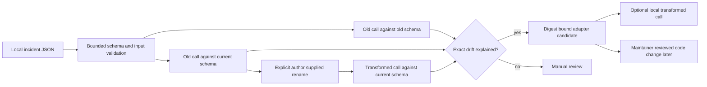

# Agent Repair Network: first failure class

Agent Repair Network starts with one narrowly testable problem: an MCP tool changes the name of a scalar argument while retaining its type. A caller that still sends the old name fails JSON Schema validation. This release turns a **user-supplied, local** incident into a schema-level reproduction and a candidate argument adapter. It never connects to the MCP server, sends the call, opens a pull request, or deploys a repair.



## Reproduce and prepare a candidate

```bash
python -m pip install -e .
agentresilience repair analyze examples/mcp-schema-rename.json --output /tmp/repair-analysis.json
agentresilience repair apply examples/mcp-schema-rename.json /tmp/repair-analysis.json --output /tmp/transformed-call.json
```

`analyze` exits 0 for a candidate and 2 when manual review is required. The analysis report includes only tool/argument names, schema errors, schema digests, and the proposed rename; it deliberately omits argument **values** and hashes the incident ID. The fingerprint is stable across incidents with the same schemas and rename, so it can group recurring drift without including the call payload. `apply` writes the transformed arguments to a local file and therefore **can contain sensitive customer values**. Keep that file out of Git and never attach it to a public issue.

The input is a JSON object with `schema_version`, `incident_id`, `tool_name`, `original_schema`, `current_schema`, `arguments`, and `renames`. Both schemas must be strict top-level objects (`additionalProperties: false`) with scalar `string`, `integer`, `number`, or `boolean` properties. Unsupported JSON Schema keywords, nested objects, ambiguous changes, type changes, unrelated missing required fields, and changes that do not reproduce fail closed. The rename must be supplied explicitly by the operator; the engine does not guess semantics from similar names.

## Contribute a real failure safely

Use the repository's **Repair case** issue template with an anonymized schema-level reproduction and the non-sensitive analysis report. Do not post logs, original call values, credentials, tokens, personal data, customer identifiers, or private endpoints. A maintainer can review whether the reported change is real, reproduce it with a synthetic fixture, and prepare a code or adapter PR for the affected project. Third-party maintainers must decide whether to merge; this project does not act on their behalf.

The evidence hierarchy is: local schema reproduction → integration test against an authorized staging endpoint → owner-reviewed patch → observed destination-state recovery. Only the first step is implemented here. A schema-valid transformed call might still perform the wrong business action. Until an owner verifies authorization, side effects, rollback and acceptance, call this a **candidate**, not a production repair.

## Evaluation and rollout gates

Track outside incidents received, fraction reproduced, fraction yielding a candidate, reviewer acceptance, time to accepted patch, recurrence after deployment, and regressions in unrelated calls. Initially publish these only from actual opted-in contributions; do not infer adoption from synthetic fixtures. The first milestone is ten outside reports, five independent reproductions, and two accepted third-party repair PRs.

This module complements [MCP Compatibility](https://github.com/AAH20/mcp-compatibility), which measures tool catalogs and endpoint behavior. Future integration can import its authorized catalog snapshots, but the current compatibility report does not include full tool input schemas; no automatic ingestion is claimed.
